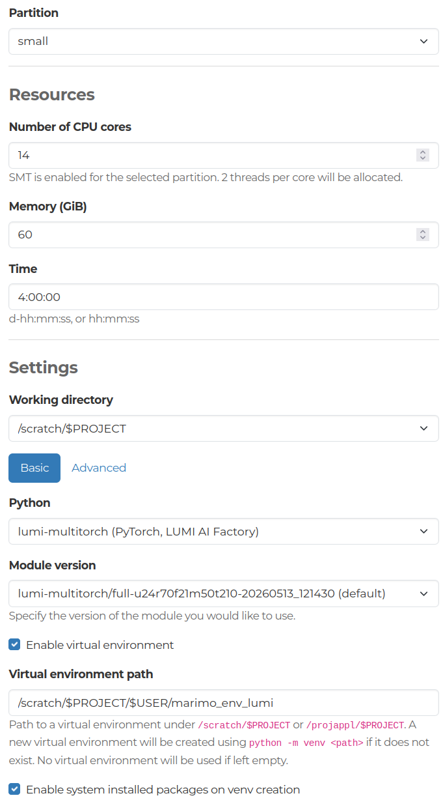

# Data

Scientific climate-related articles from Copernicus are used in this project.

# How to

A few alternatives to run the code:
1. (Preferred method) To inspect and run the codes in a notebook-y fashion: 
    - First, clone the repo to /scratch/<project_xxx>/\<user>/
    - Head to LUMI web interface and launch the Marimo OOD app (currently available only in [testing version](https://ood-testing.lumi.csc.fi/public/), located in *My Interactive Sessions*)
        - Select the project and set the working directory to the project folder where this repo is cloned to (scratch). Marimo opens user's own folder under the project as the default workspace, so the cloned repo should appear in the file list in Marimo view.
        - Adjust the settings (Partition: `small`, number of CPU cores: `14`, memory: `60 GiB`, time: `4:00:00`, working directory: `/scratch/$PROJECT`, python: `lumi-multitorch`, module version: `...-20260513_121430 / default`)
        - The following settings are also required for marimo to work properly inside lumi-multitorch modules:
            - Enable the virtual environment and add the virtual environment path: `/scratch/$PROJECT/$USER/marimo_lumi_venv`
            - Enable system installed packages on venv creation

        

    - After opening the marimo app, open the climate-llm-finetuning/src/a_data/data_gather.py file in the marimo main view
    - There might be some other libraries that need to be installed, proceed to install them when running the first cell
        - For lxml, install version 5.4.0
        - For pymupdf, install version 1.27.2.3
    - Run the notebook
    - There are a couple of variables that can be changed in the first cell (DATA_AMOUNT and REMOVE_FILES). Increasing the amount of data with DATA_AMOUNT variable will take more time (or might not even work properly after some thousand downloads), but it would improve the finetuning quality.

2. To only run the code, execute the [according slurm script](./data_gather.sh) from project root in the LUMI login node with command `sbatch src/a_data/data_gather.sh`

# Some known problems

Currently, as of 20.2.2026, programmatical access to journals in copernicus.org is restricted. We are planning on having the data stored in some storage service provided by CSC. If running the notebook, you may not be able to download all the articles as PDFs/XMLs.